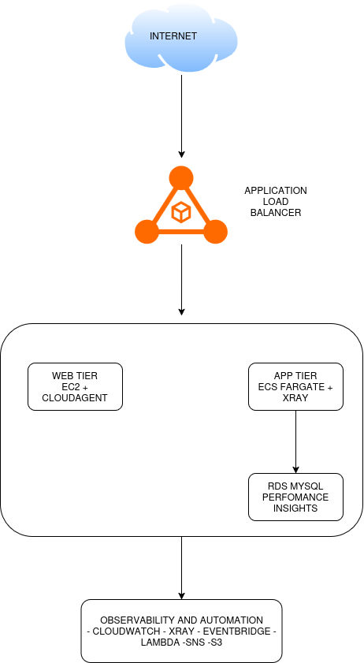

# Observability-as-a-Service

Centralized monitoring, logging, and automated incident response for a
three-tier AWS application, built entirely in Terraform.

## Architecture


- **Web tier**: EC2 Auto Scaling Group behind an ALB, running Apache. The
  CloudWatch Agent ships CPU/memory/disk metrics and access/error logs.
- **App tier**: ECS Fargate service on `/api/*`, with an X-Ray daemon
  sidecar for distributed tracing and Container Insights enabled.
- **Data tier**: RDS MySQL in private subnets, Performance Insights and
  Enhanced Monitoring enabled, reachable only from the ECS tier.

## Observability layer

- **Metrics & logs**: CloudWatch Agent (EC2), automatic ECS/ALB metrics,
  Container Insights, RDS Performance Insights + Enhanced Monitoring.
- **Long-term storage**: CloudWatch Logs → subscription filter → Kinesis
  Firehose → S3, streaming app and web tier logs continuously.
- **Analysis**: two saved CloudWatch Logs Insights queries
  (`app-error-spike-detection`, `app-recent-error-detail`).
- **Alerting**: 3 CloudWatch Alarms (ECS CPU > 80%, ALB 5xx rate > 5%,
  app ErrorCount > 10/5min).
- **Automation**: EventBridge rules route each alarm's ALARM state to a
  remediation — two Lambda functions (force ECS redeployment, tag EC2
  instances for investigation) and one direct SNS notification path.
- **Dashboard**: single CloudWatch dashboard with ALB, ECS, RDS, and
  alarm-status widgets.

## Repository layout
| File | Purpose |
|---|---|
| `providers.tf` | AWS + archive provider config |
| `variables.tf` | All input variables |
| `network.tf` | VPC, subnets, NAT, route tables |
| `security_group.tf` | Tier-scoped security groups |
| `data_tier.tf` | RDS MySQL |
| `web_tier.tf` | ALB, ASG, CloudWatch Agent |
| `app_tier.tf` | ECS cluster, task def, service |
| `cloudwatch_alarms.tf` | 3 alarms + log metric filter |
| `eventbridge.tf` | Alarm → remediation routing |
| `lambda_remediation.tf` | 2 remediation Lambdas + IAM |
| `sns.tf` | On-call notification topic |
| `logs_insights.tf` | Saved Logs Insights queries |
| `kinesis_firehose.tf` | Log streaming to S3 |
| `dashboard.tf` | CloudWatch dashboard |
| `outputs.tf` | All output values |
| `lambda/` | Lambda Python source |
| `templates/` | EC2 user-data + CW Agent config |
## Deploy

```bash
export TF_VAR_db_master_password='YourStrongPassword123!'
terraform init
terraform plan -out tfplan
terraform apply tfplan
```

```bash
terraform output alb_dns_name
curl http://$(terraform output -raw alb_dns_name)/
curl http://$(terraform output -raw alb_dns_name)/api/
```

## Testing the automation (mock failure test)

Each alarm can be forced into `ALARM` state directly, which triggers the
same EventBridge event a real breach would:

```bash
aws cloudwatch set-alarm-state \
  --alarm-name "$(terraform output -raw ecs_cpu_alarm_name)" \
  --state-value ALARM \
  --state-reason "Manual test"
```

Repeat for `alb_5xx_alarm_name` and `app_error_alarm_name`. Verify via:

```bash
aws logs tail /aws/lambda/observability-as-a-service-restart-ecs-task --since 5m
aws logs tail /aws/lambda/observability-as-a-service-tag-ec2-investigate --since 5m
```

...and check email for the SNS notification. Reset afterward:

```bash
aws cloudwatch set-alarm-state --alarm-name "<name>" --state-value OK --state-reason "Reset"
```

## Teardown

```bash
terraform destroy
```

RDS is configured with `skip_final_snapshot = true` for lab iteration —
no snapshot naming collisions on repeated destroy/apply cycles. Note that
destroying and re-applying produces new endpoints/DNS names each time.

## Cost note

Continuously-running costs: NAT Gateway (~$0.045/hr), RDS `db.t3.medium`
(~$0.07-0.08/hr — required for Performance Insights support), ALB
(~$0.025/hr), EC2 + Fargate (~$0.04/hr combined). Destroy when not
actively working with it.